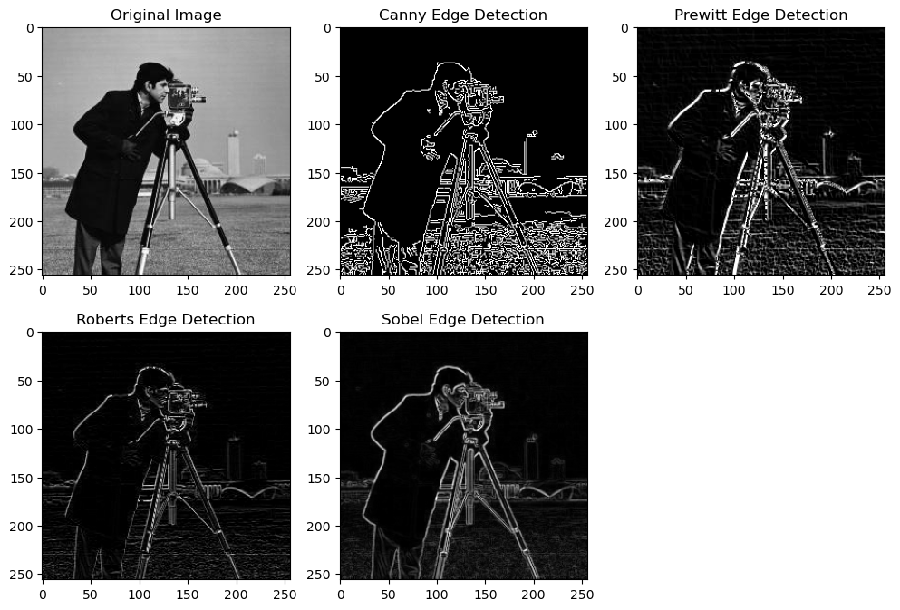

# 4.Edge-Detection-Algorithms
Explore and compare the effectiveness of popular edge detection algorithms, including Canny, Sobel, Prewitt, and Roberts.
This repository explores and compares different edge detection algorithms—Canny, Sobel, Prewitt, and Roberts. Edge detection algorithms are computational techniques designed to identify and highlight boundaries or transitions in an image. These boundaries often represent significant changes in intensity or color, corresponding to the edges of objects within the image. The primary goal is to accurately locate these boundaries, as edges provide essential information about the structure and content of an image.

## Algorithms

### 1. Canny Edge Detector
- **Explanation:**
  - Canny edge detector is a multi-stage algorithm known for its ability to detect a wide range of edges while minimizing false positives. It involves smoothing the image with a Gaussian filter, finding intensity gradients, applying non-maximum suppression, and using hysteresis to track edges.
- **Strengths:**
  - High accuracy in detecting edges.
  - Good at handling noise due to Gaussian smoothing.
  - Well-defined edges with low false positives.
- **Weaknesses:**
  - Computationally more intensive compared to simpler methods.

### 2. Sobel Edge Detector
- **Explanation:**
  - Sobel operator is a gradient-based method that uses convolution with Sobel kernels to calculate the gradient magnitude. It is particularly effective for detecting edges with a specific orientation.
- **Strengths:**
  - Simple and computationally efficient.
  - Effective for detecting edges with a dominant orientation.
- **Weaknesses:**
  - May be sensitive to noise.

### 3. Prewitt Edge Detector
- **Explanation:**
  - Similar to Sobel, Prewitt is a gradient-based edge detection method that uses convolution with Prewitt kernels to calculate the gradient magnitude. It is often employed for detecting vertical and horizontal edges in images.
- **Strengths:**
  - Simple and easy to implement.
  - Effective for specific edge orientations.
- **Weaknesses:**
  - Sensitivity to noise.

### 4. Roberts Edge Detector
- **Explanation:**
  - Roberts Cross operator is one of the simplest edge detection methods, utilizing a pair of 2x2 convolution kernels to approximate gradients in the horizontal and vertical directions.
- **Strengths:**
  - Extremely computationally efficient.
  - Simple and easy to understand.
- **Weaknesses:**
  - Less effective in detecting edges compared to more sophisticated algorithms.
  - Sensitive to noise.

## Edge Detection Comparison

### Accuracy:
- Canny tends to offer high accuracy with well-defined edges.
- Sobel and Prewitt provide decent accuracy, especially for edges with specific orientations.
- Roberts, being a simpler method, may miss certain edges and is less accurate than the others.

### Computational Complexity:
- Canny is computationally more intensive due to multiple stages.
- Sobel, Prewitt, and Roberts are simpler and computationally more efficient.

### Noise Handling:
- Canny is effective in handling noise due to Gaussian smoothing.
- Sobel and Prewitt may be sensitive to noise.
- Roberts, being a basic operator, can be sensitive to noise.

## Edge Detection Results

